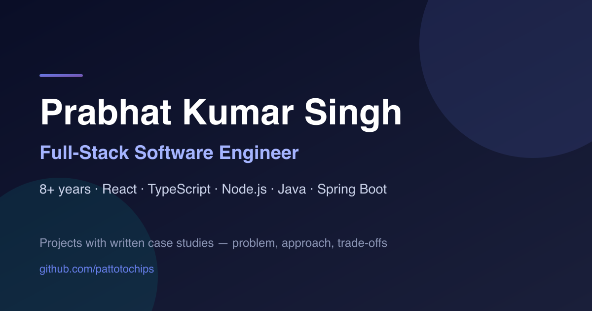

# Portfolio — Prabhat Kumar Singh

Personal portfolio and project showcase. Full-stack software engineer, 8+ years, based in Noida.

**Live:** https://pattotochips.github.io/my-portfolio/



Each project gets a landing page with a written case study — the problem, the approach, the
trade-offs that were actually made, and what I'd do differently — rather than just a feature list.

---

## Projects

Eight projects, each with its own landing page and case study.

| Project | What it is | Kind | Live | Source |
|---|---|---|---|---|
| **HR Query Engine** | Hybrid AI employee search. GPT splits a natural-language query into meaning and hard constraints; Weaviate handles semantic similarity, PostgreSQL enforces the filters. Embedding cache bounds API cost. | Backend | — | [Backend](https://github.com/pattotochips/HR-Query-Engine---Backend) · [Frontend](https://github.com/pattotochips/HR-Query-Engine--Frontend) |
| **Face Filter App** | Real-time AI face filters over a live camera feed. Three MediaPipe models in one render loop, positional smoothing, snow particles, a hand-gesture game, and a drag-and-drop sequencer. | Web app | [Demo](https://pattotochips.github.io/my-portfolio/face-filter) | [Repo](https://github.com/pattotochips/face-filter-app) |
| **WikiTrail** | Browser extension mapping your Wikipedia rabbit holes as an interactive D3 graph. Dwell time sets node size, per-tab sessions, annotations, three export formats. | Extension | — | [Repo](https://github.com/pattotochips/WikiTrail) |
| **Inkmark** | Persistent web highlighter with inline notes. The real problem is re-anchoring a highlight after the page is rebuilt — solved with XPath anchored to the nearest stable id. Zero dependencies. | Extension | — | [Repo](https://github.com/pattotochips/inkmark) |
| **Expense Splitter** | Shared-expense tracker. Firebase Auth, Firestore listeners for cross-device sync, balances derived from the expense list rather than stored. | Web app | [Live](https://papaya-pie-7204f0.netlify.app/) | [Repo](https://github.com/pattotochips/expense-splitter) |
| **OOO Generator** | Pixel-art Out of Office generator. Four tones that restructure the message, deterministic generation with no model call, chiptune loop synthesized at runtime. Tested with Jest + RTL. | Web app | [Live](https://ooo-generator.netlify.app/) | [Repo](https://github.com/pattotochips/OOO-generator) |
| **Travis Filter** | Desktop video filter — silhouette segmentation composited over procedural neon stripes. Morphological mask refinement plus temporal smoothing to stop the outline flickering. Ships as a binary. | Desktop | — | [Repo](https://github.com/pattotochips/travis-filter) |
| **Birthday Reminder Bot** | Discord bot taking reminders by chat command. Relative and absolute scheduling, timezone-aware dates, per-user timer tracking. | Bot | — | [Repo](https://github.com/pattotochips/bot) |

Not every project can have a hosted demo — an extension cannot run on a web page, a desktop OpenCV
app needs a local webcam, and the HR engine needs PostgreSQL, Weaviate and an API key. Those pages
say so explicitly and lead with architecture, code, and install steps instead of a dead button.

[deep-ar-demo](https://github.com/pattotochips/deep-ar-demo) is covered as a related experiment on
the Face Filter page, since the two are worth reading against each other — a commercial AR SDK
versus building the same effects from raw landmarks.

No project's source lives in this repository except the portfolio itself; every card links out.

---

## Tech stack

| Layer | Choice |
|---|---|
| Framework | React 19 |
| Build | Vite 5 |
| UI | Material UI 7 + Emotion |
| Routing | React Router 7 (`BrowserRouter`) |
| Computer vision | MediaPipe Tasks Vision (face, hand, pose landmarkers) |
| Interaction | dnd-kit (sequence builder) |
| Rendering | Canvas 2D + WebGL |
| Image pipeline | sharp (build-time WebP conversion) |
| CI/CD | GitHub Actions → GitHub Pages |

---

## Getting started

Requires Node `20.19.0` (see [`.nvmrc`](.nvmrc)).

```bash
nvm use          # or install Node 20.19.0
npm ci

npm run dev      # dev server on http://localhost:5173/my-portfolio/
```

### Scripts

| Command | Purpose |
|---|---|
| `npm run dev` | Vite dev server |
| `npm run build` | Production build into `dist/` (also emits `404.html`) |
| `npm run preview` | Serve the production build locally |
| `npm run lint` | ESLint over the whole project |
| `npm run assets:optimize` | Re-convert `public/assets` PNGs to WebP and regenerate `og-image.png` |

The face filter app is reachable at `/face-filter/app`. It sits behind a simple gate; append
`?demo=1` to skip it, which is what the landing page's "Try it Live" button does.

---

## Project structure

```
src/
├── App.jsx                     # Router, theme, lazy route definitions, skip link
├── data/
│   ├── profile.js              # Identity, contact, skills, experience, education
│   └── caseStudies.js          # Case study copy for all four projects
├── styles/
│   └── shared.js               # Colour tokens, glass card, gradient text, focus ring
└── components/
    ├── PortfolioHome.jsx       # Home: hero, projects, about, skills, experience, education
    ├── CaseStudy.jsx           # Reusable problem/approach/trade-offs/next section
    ├── ProjectLinks.jsx        # Paired live-demo / view-source buttons
    ├── SiteFooter.jsx          # Contact links, shown on every page
    ├── DemoLanding.jsx         # Face Filter landing page
    ├── ExpenseSplitterLanding.jsx
    ├── OOOGeneratorLanding.jsx
    ├── BirthdayBotLanding.jsx
    ├── FaceFilterApp.jsx       # Face filter app shell (lazy-loaded)
    ├── Login.jsx               # Gate for the face filter app
    ├── MenuSettings.jsx        # Operator console for filters, ads, game, sequencing
    └── VideoScreen.jsx         # Camera capture, MediaPipe inference, canvas rendering
```

`profile.js` and `caseStudies.js` are the content layer — updating a job, a skill, or a case study
means editing data, not components.

---

## Pending media

Screenshots and GIFs are wired up but not yet captured. Each slot renders a labelled dashed frame at
the correct aspect ratio; drop the file into `public/media/` and set `ready` on that `MediaSlot` to
go live. Nothing else needs to change — sizing, lazy-loading and alt text are already in place.

| File | Page | Shows |
|---|---|---|
| `face-filter-santa.gif` | Face Filter | Santa hat and beard tracking a face live |
| `face-filter-game.gif` | Face Filter | Hand-gesture game picking a winner |
| `face-filter-settings.png` | Face Filter | Operator console and sequencer |
| `hr-query-engine-search.png` | HR Query Engine | Search UI with query and ranked results |
| `wikitrail-graph.png` | WikiTrail | Dashboard — sidebar, graph, detail panel |
| `wikitrail-trail.gif` | WikiTrail | A trail building while browsing |
| `inkmark-highlight.gif` | Inkmark | Selecting text and picking a colour |
| `inkmark-dashboard.png` | Inkmark | Highlights grouped by site, with search |
| `travis-filter-stripes.gif` | Travis Filter | Mode 0 — tinted silhouette over stripes |
| `travis-filter-infrared.gif` | Travis Filter | Mode 1 — infrared silhouette |
| `expense-splitter-groups.png` | Expense Splitter | Group view with expenses and balances |
| `expense-splitter-balance.png` | Expense Splitter | Settle-up balances across members |
| `ooo-generator-app.png` | OOO Generator | Generator with live preview |
| `ooo-generator-tones.gif` | OOO Generator | Switching tone, message restructures |
| `birthday-bot-discord.png` | Birthday Bot | Adding a reminder and the announcement |

---

## Implementation notes

### Code splitting

Every route past the home page is loaded with `React.lazy`, and heavy dependencies are pinned to
their own chunks via `manualChunks`. MediaPipe (~123 kB) and dnd-kit (~45 kB) only download when
someone actually opens the face filter app, rather than shipping to anyone who loads the home page.

### Asset pipeline

The overlay art started as 6.4 MB of committed PNGs, served as-is. [`scripts/optimize-assets.mjs`](scripts/optimize-assets.mjs)
downscales them to a 1080px bound and converts to WebP, bringing the set to ~513 kB (−92%). The
same script generates the 1200×630 social card from an inline SVG, so the preview image stays in
sync with the site palette without a design tool.

### SPA on GitHub Pages

GitHub Pages has no server-side rewrite, so a deep link like `/my-portfolio/ooo-generator` would
404 under `BrowserRouter`. A small Vite plugin copies `index.html` to `404.html` at build time;
Pages serves that for unknown paths, the SPA boots, and the router resolves the URL. Unmatched
routes redirect home.

### Accessibility

- Global `prefers-reduced-motion` sweep — the floating and snowfall decoration is purely visual, so
  it stops when the OS asks it to.
- Skip-to-content link with a focusable `<main>` target.
- Visible `:focus-visible` rings sized to work on the glass surfaces.
- Body-text colours are centralised in `styles/shared.js` and chosen to clear WCAG AA against the
  dark background.
- Gradient-clipped headings fall back to a solid colour under `forced-colors`, where clipped text
  would otherwise render invisible.

---

## Deployment

Pushing to `master` triggers [`.github/workflows/deploy.yml`](.github/workflows/deploy.yml), which
installs with `npm ci`, lints, builds, and publishes `dist/` to GitHub Pages. Node comes from
`.nvmrc` so CI and local stay in step. `npm run deploy` publishes manually via `gh-pages` if needed.

Note that lint is a blocking step — a lint error fails the deploy.

---

## Contact

- **Email** — prabhatkumarsingh336@gmail.com
- **LinkedIn** — https://www.linkedin.com/in/prabhat-singh-1394n/
- **GitHub** — https://github.com/pattotochips
- **Résumé** — [PDF](public/Prabhat_Kumar_Singh_Resume.pdf)
